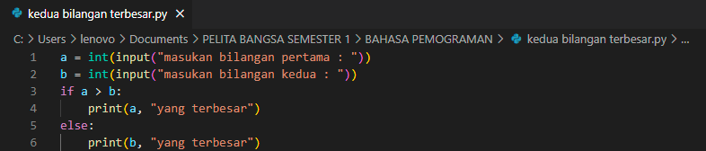
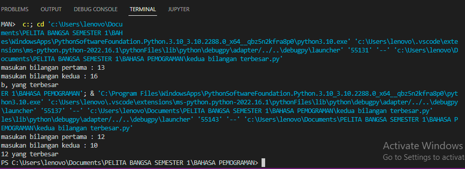
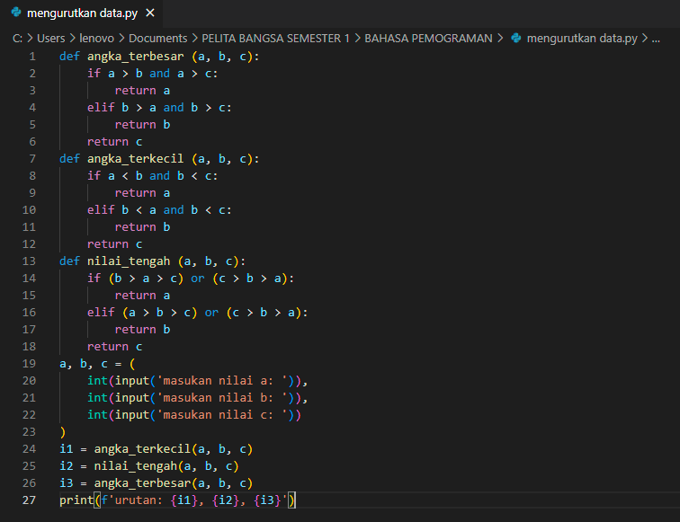
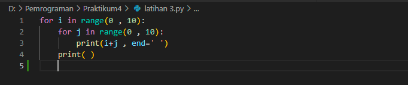
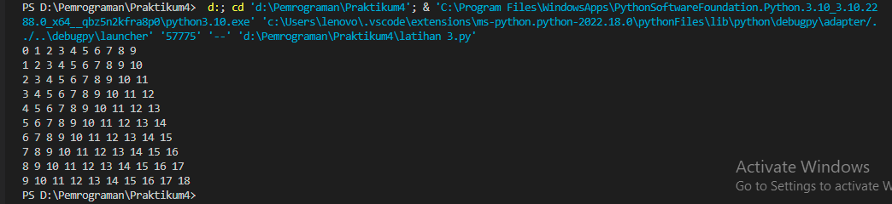
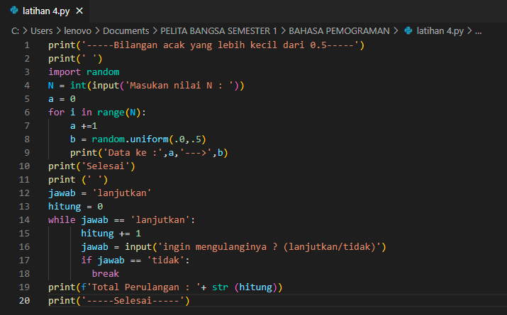
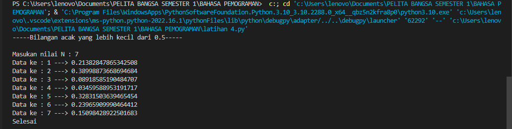

# project Praktikum4

## Lab 2 Struktur Kondisi

### Latihan 1 Menentukan Bilangan Terbesar

Dengan menggunakan statement IF bisa menentukan mana bilangan terbesar dari data yang kita input dengan menambahkan sytax max pada code,seperti gambar di bawah ini

Hasil setelah di run program bisa menentukan bilangan mana yang terbesar yang kita input kedalam program

### Latihan 2 Mengurutkan data dari variabel yang terkecil

Untuk mengurutkan variabel dari yang terkecil kita bisa menggunakan statement if dan elif pertama kita membuat nilai terkecilnya terlebih dahulu dan setelah itu kita membuat nilai tengah unutuk mengurutkan 3 variabel yang diminta, seperti gambar dibawah ini

Hasil setelah di run program bisa mengurutkan nilai terkecil, terbesar, dan nilai tengah pada variabel

## Lab 3 Perulangan

### Latihan 1 Melakukan perulangan bertingkat

Membuat perulangan bertingkat kita bisa menggunakan syntax range untuk menentukan wilayah atau jarak yang di inginkan, seperti gambar dibawah ini

Hasil setelah di run programn perulangan akan dilakukan oleh program secara otomatis sesuai dengan range yang dibuat

### Latihan 2 Menampilkan bilangan acak yang lebih kecil dari 0,5

Untuk menampilkan bilangan yang lebih kecil dari angka 0,5 dengan import libary random, seperti gambar di bawah ini dan untuk melakukan perulangan kita bisa menggunakan syntax while dan for, seperti gambar di bawah ini

Hasil setelah di run program program akan menampilkan hasil bilangan yang lebih kecil dari 0,5 dan bisa melakukan pengulangan program

SELESAI.